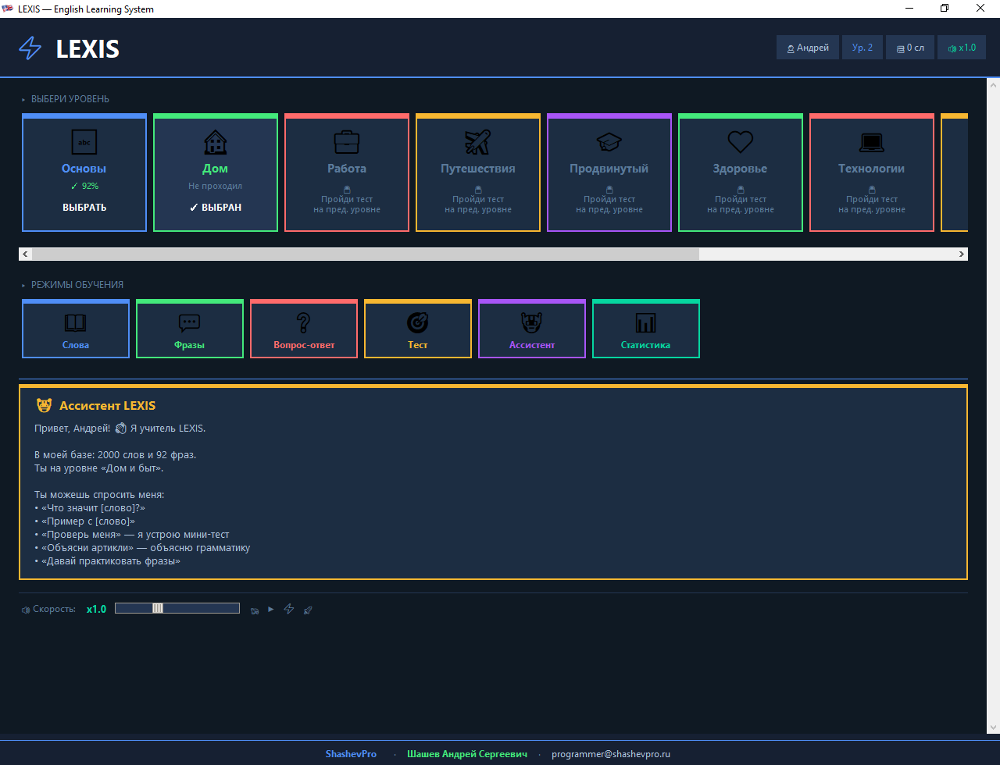
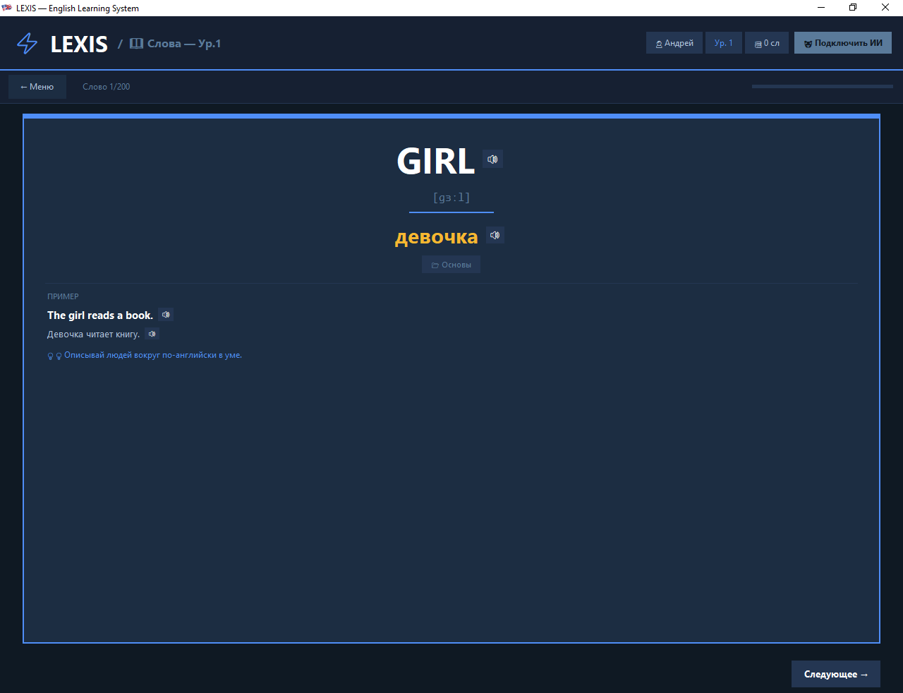
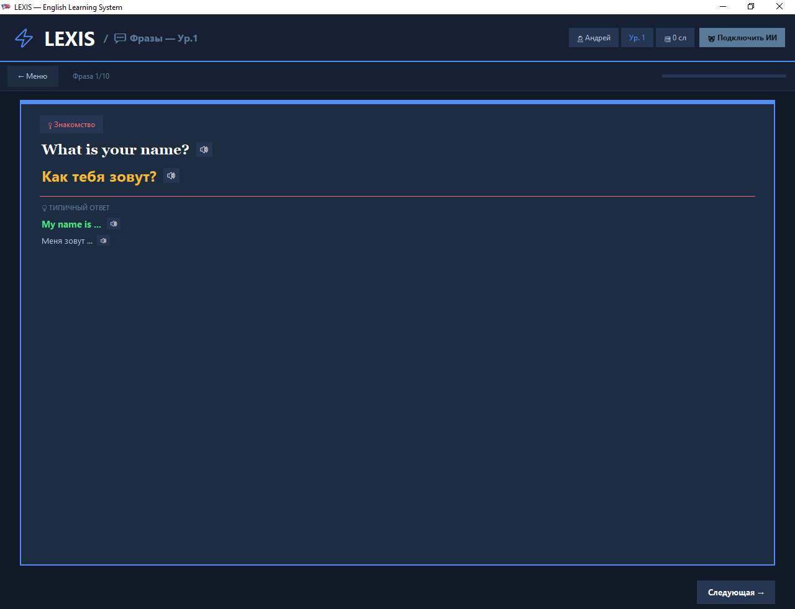
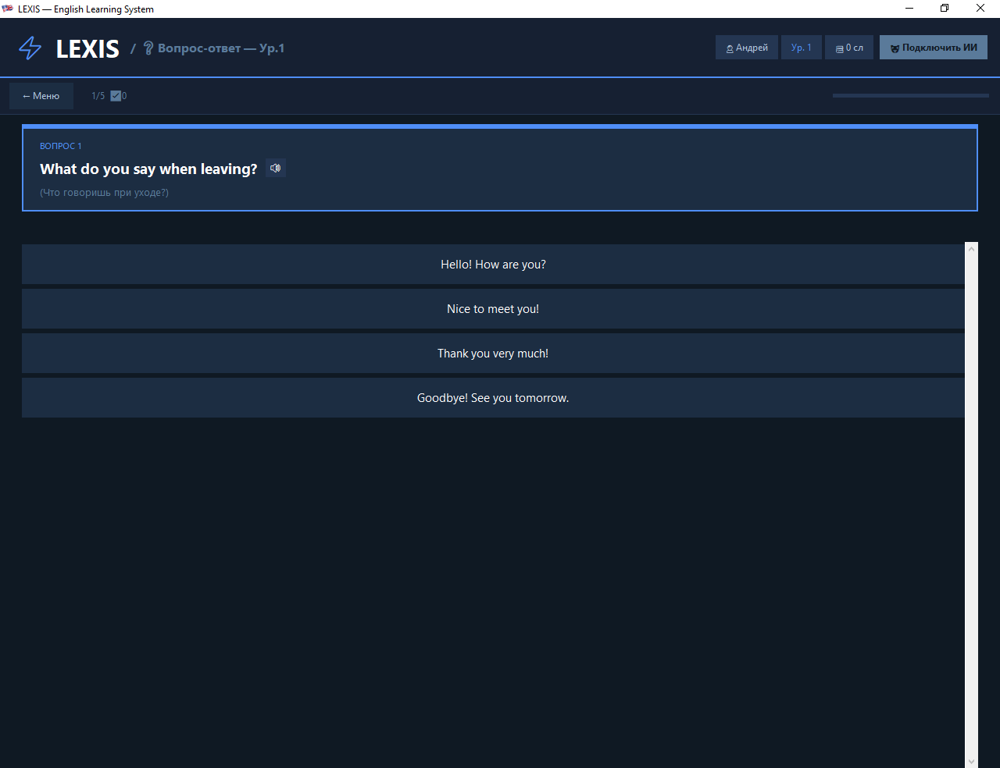
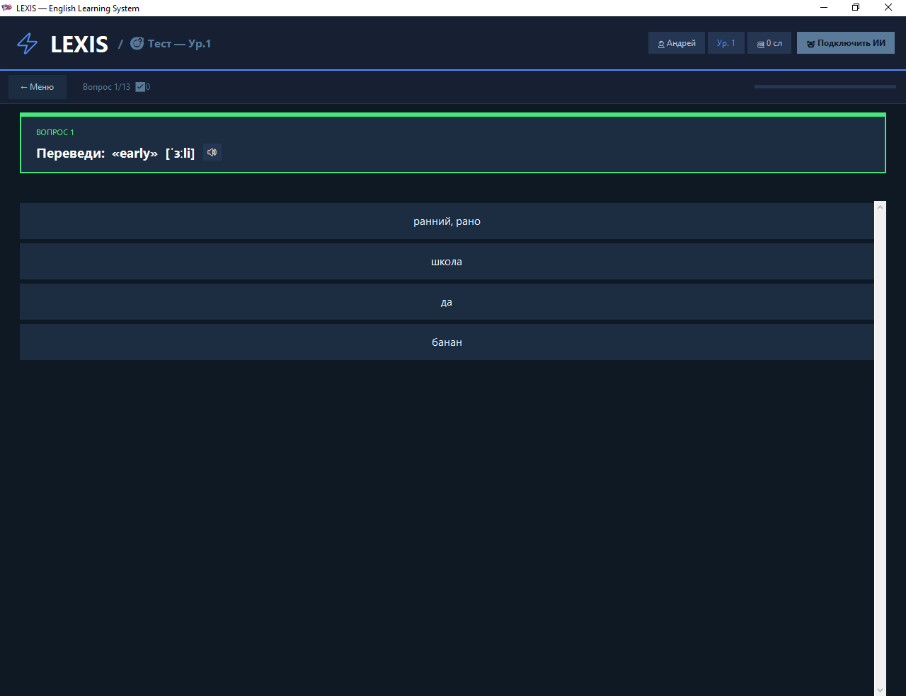
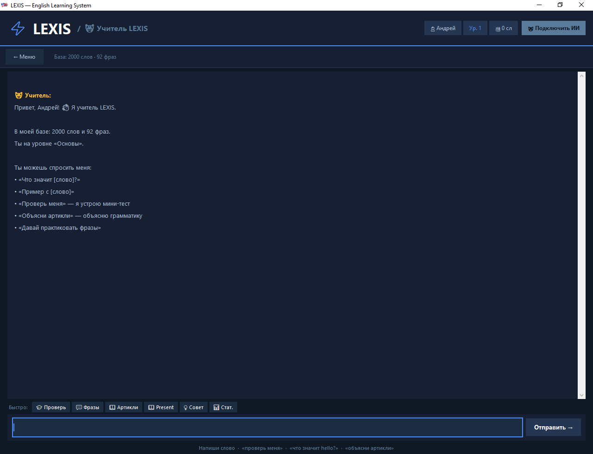
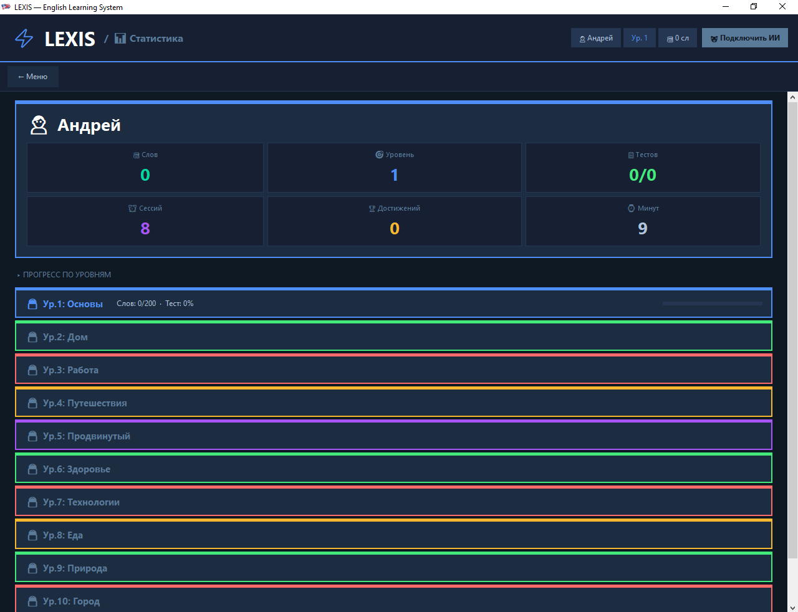

# LEXIS — English Learning System

### 2000 слов, живая озвучка, 6 режимов обучения · 2000 words, live TTS, 6 study modes

---

## 🇷🇺 Русский

Десктопная программа для изучения английских слов на Windows. Никаких регистраций, подписок и обязательного интернета — скачал, распаковал, запустил.

Каждое слово озвучивается живым голосом: английский (Jenny, американский) и русский (Светлана). Показывает транскрипцию и пример в предложении на обоих языках.

**Подходит для самостоятельного изучения с нуля — школьникам, студентам, взрослым.**

### Версии

| | 🆓 FREE | 💎 PRO |
|---|---|---|
| Слов | 100 (5 тем × 20) | **2000 (10 тем × 200)** |
| Режимы обучения | Все | Все |
| Офлайн-озвучка | После первого прослушивания | **Сразу, кеш включён** |
| Цена | Бесплатно | Лицензионный ключ |

### Темы PRO-версии

| № | Тема | Уровень |
|---|------|---------|
| 1 | 🔤 Основы | A1 |
| 2 | 🏠 Дом и быт | A1–A2 |
| 3 | 💼 Работа и дела | A2–B1 |
| 4 | ✈️ Путешествия | A2–B1 |
| 5 | 🎓 Продвинутый | B2–C1 |
| 6 | ❤️ Здоровье, спорт и эмоции | A2–B2 |
| 7 | 💻 Технологии и интернет | A2–B2 |
| 8 | 🍕 Еда и рестораны | A2–B1 |
| 9 | 🌿 Природа, погода и животный мир | A2–B1 |
| 10 | 🏙️ Город, транспорт и покупки | A2–B1 |

### Режимы обучения

- **📖 Слова** — карточки с транскрипцией, переводом и примером; скорость озвучки ×0.5–×2.0
- **💬 Фразы** — диалоговые фразы с контекстом и ответом собеседника
- **❓ Вопрос-ответ** — вопрос на английском, четыре варианта ответа
- **🎯 Тест** — выбери правильный перевод, результат в конце
- **🧑‍🏫 Учитель** — встроенный ассистент: объясняет слова, грамматику, устраивает мини-тест
- **📊 Статистика** — прогресс по каждому уровню, результаты тестов, сессии

---

## 🇺🇸 English

A desktop app for learning English vocabulary on Windows. No registration, no subscription, no mandatory internet — unpack and start learning immediately.

Every word is voiced by real TTS: English (Jenny, American) and Russian (Svetlana). Shows transcription and a usage example in both languages.

**Suitable for self-study from scratch — students, adults, professionals.**

### Editions

| | 🆓 FREE | 💎 PRO |
|---|---|---|
| Words | 100 (5 topics × 20) | **2000 (10 topics × 200)** |
| Study modes | All | All |
| Offline TTS | After first playback | **Included from the start** |
| Price | Free | License key |

### Study modes

- **📖 Words** — flashcards with transcription, translation, example sentence; speed ×0.5–×2.0
- **💬 Phrases** — dialogue phrases with context and reply
- **❓ Q&A** — English question, four answer choices, voiced after selection
- **🎯 Test** — translate the word, pick from four options, score shown at the end
- **🧑‍🏫 Teacher** — built-in assistant: explains words, grammar, runs mini-quizzes; works offline
- **📊 Statistics** — progress per level, test scores, session count

---

## 🖥 Screenshots

**Main screen — level selection and study modes:**

**Words mode — flashcard with transcription and example:**

**Phrases mode — dialogue with translation:**

**Q&A mode — English question, four choices:**

**Test mode — translate the word:**

**Teacher mode — built-in assistant:**

**Statistics — progress across all levels:**

---

## ⚙️ Requirements

- Windows 10 / 11 (64-bit)
- RAM: 256 MB+
- Disk: ~200 MB (with TTS cache)
- Internet: PRO — fully offline; FREE — required only on first playback of a new word
- Portable — no installation required

---

## 💼 Коммерческий продукт · Commercial product

Исходный код закрыт. LEXIS — коммерческая программа под брендом **ShashevPro**.  
Source code is not public. LEXIS is a commercial product by **ShashevPro**.

**Купить лицензию · Buy a license:**

- 🌐 [shashevpro.ru](https://www.shashevpro.ru)
- 🛒 [kwork.ru/user/shashevpro](https://kwork.ru/user/shashevpro)
- ✉️ programmer@shashevpro.ru
- 💬 [vk.com/shashevpro](https://vk.com/shashevpro)

---

**© ShashevPro · Andrey Shashev** — commercial software, source not public.

